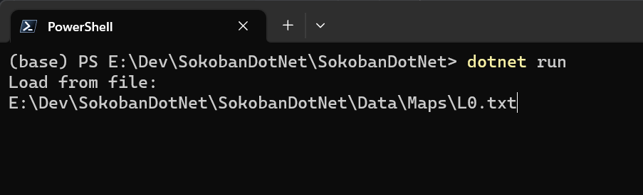
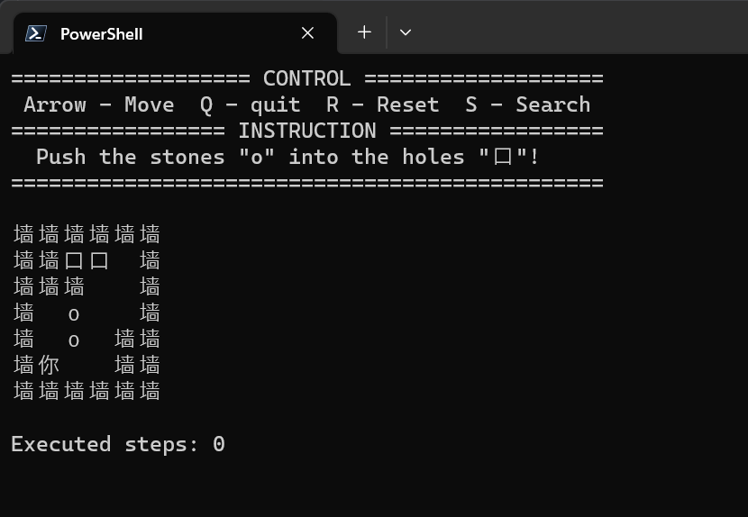
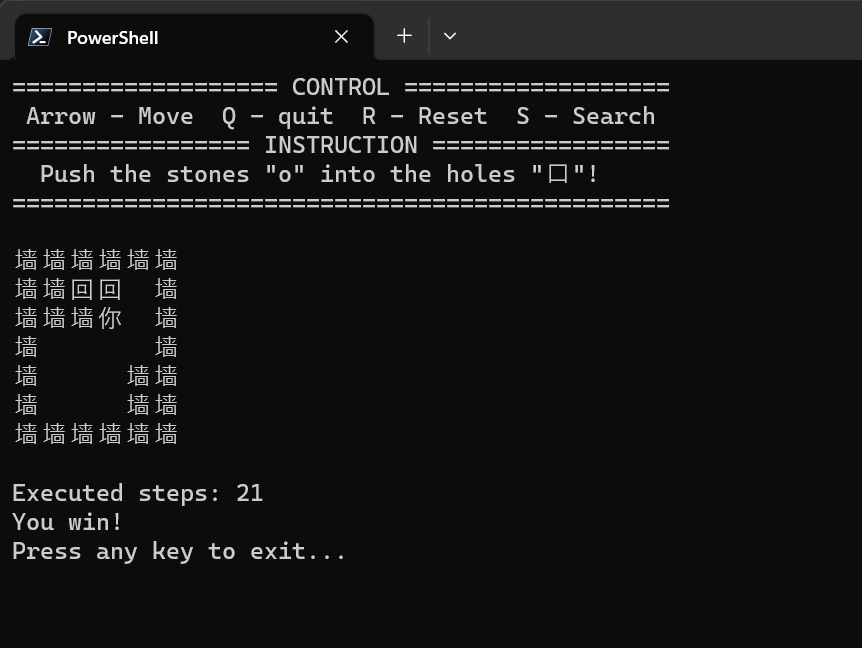

# 人工智能基础 课程项目 1 - 推石头 实验报告

## 游戏实现

我们首先实现一个推石头的游戏。游戏基于 .NET 6 开发，需要 [安装 ASP.NET 运行时](https://dotnet.microsoft.com/en-us/download/dotnet/6.0)。

### 运行

通过命令行运行 `SokobanDotNet.exe` 即可启动游戏。对于其他平台，可以在 `Codebase/SokobanDotNet/SokobanDotNet` 目录下编译：

```shell
dotnet restore && dotnet build
```

### 基本操作

#### 加载关卡

游戏启动后，通过路径指定关卡。



关卡文件应该是多行的文本文件，格式如下

```
000000
002210
000110
014110
014100
081100
000000
```

数码采用 Flags Enum，即用每个二进制位表示一种格子

| 数码 $n$ | 0         | 1         | 2         | 3         | 4         |
| -------- | --------- | --------- | --------- | --------- | --------- |
| $2^n$    | 1         | 2         | 4         | 8         | 16        |
| 二进制   | `0b00000` | `0b00010` | `0b00100` | `0b01000` | `0b10000` |
| 格子类型 | 障碍      | 地面      | 洞口      | 石头      | 玩家      |

> 按位或操作 `|` 可以叠加两个格子，按位与 `&` 可以用于比较两个格子。
>
> 地图至少为 3 行 3 列，最外围必须是 `1`，石头和洞的数量必须一致。

#### 游戏操作

进入关卡后可以看到画面，"口"代表洞口，`o` 代表石头，"你"代表玩家。



通过方向键移动，`Q` 退出游戏，`R` 重置游戏，`S` 启动搜索算法从当前状态搜索解。将石头推入洞口后该位置的"口"变为"回"。将所有石头推入洞口即可获胜。



## 问题建模（Baseline）

我们首先给出一个比较简单的建模。

- 状态 $s$ ：$H \times W$ 的场景表格
  - 包含 $N$ 个石头，位置为 $(h^{(i)}_s, w^{(i)}_s)$；
  - 包含 $N$ 个洞口，位置为 $(h^{(i)}_h, w^{(i)}_h)$；
  - 每一格内可能有不同的值：障碍物、空地、洞；
  - 空地、洞还可以叠加人、箱子（例如空地 + 箱子）。
- 动作 $a$：向上/下/左/右移动
- 状态转移：$(s_t, a_t) \to s_{t+1}$，根据游戏规则，可能出现
  - 人不动
  - 人移动
  - 人推动箱子
- 目标状态：$s_T$，其中所有洞口都有一个石头（不一一对应或一一对应）

### 问题求解

针对这个场景，可以使用 A* 算法搜索。我们使用 Manhattan Distance 作为启发函数。对于石头、洞口一一对应的情景，只需计算对应石头与洞口的 Manhattan Distance 并求和
$$
h(s) = \sum_{i=1}^N \left( \vert h^{(i)}_s - h^{(i)}_h \vert + \vert w^{(i)}_s - w^{(i)}_h \vert \right)
$$
对于不一一对应的情景，计算所有配对可能中最小的 Manhattan Distance，需要求取 $A_N^N$ 次
$$
h(s) = \min_\pi \sum_{i=1}^N \left( \vert h^{(i)}_s - h^{(\pi(i))}_h \vert + \vert w^{(i)}_s - w^{(\pi(i))}_h \vert \right)
$$
采用如下的 A* 算法即可进行搜索：

1. 初始化状态 $s_0$、$g(s_0) = 0$、优先队列 $Q$、闭节点列表 $C$
2. $s_0$ 加入 $Q$，优先级系数为 $h(s_0) + g(s_0)$
3. 当 $Q$ 不为空时
   1. 从 $Q$ 取出 $s$
   2. $s$ 加入 $C$
   3. 如果 $s$ 达成了目标
      1. 计算 $s_0 \to s$ 的动作序列 $\mathbf{s} = [ a_0, \dots, a_T]$
      2. 返回 $\mathbf{s}$
   4. 列举 $s$ 的可行操作集 $a_s$
   5. 对所有 $a \in a_s$
      1. 对 $s$ 执行 $a$ 得到 $s_a$
      2. 如果 $s_a \in C$ 则跳过此 $a$
      3. $g(s_a) = g(s) + 1$
      4. $s_a$ 加入 $Q$，优先级系数为 $h(s_a) + g(s_a)$
4. 返回 $\empty$

然而，实验表明这样的解法效率很低。实际上，已经有工作指出推箱子是一个 PSpace-Complete 的问题 ([Culberson, 1997](http://webdocs.cs.ualberta.ca/~joe/Preprints/Sokoban/paper.html))，这比 NP-Hard 问题更难解决。在实验中，一个观察是游戏的空间过大，操作角色在空间中逐步移动而不推动箱子会导致巨量的价值相等的待搜索节点，导致 reward 非常 sparse。

基于此考虑，我们改变上面对游戏的建模和算法，实现一种更高效的搜索方案。

## 问题建模

- 状态 $s$：同 baseline
- 动作 $a$：移动到石头 $s_i$ 的上/下/左/右邻格，并推动箱子
- 状态转移：$(s_t, a_t) \to s_{t+1}$，只允许合理的动作，即从起始位置到目标位置存在一条通路
- 目标状态：同 baseline

采用和 baseline 一样的 A* 算法求解。

